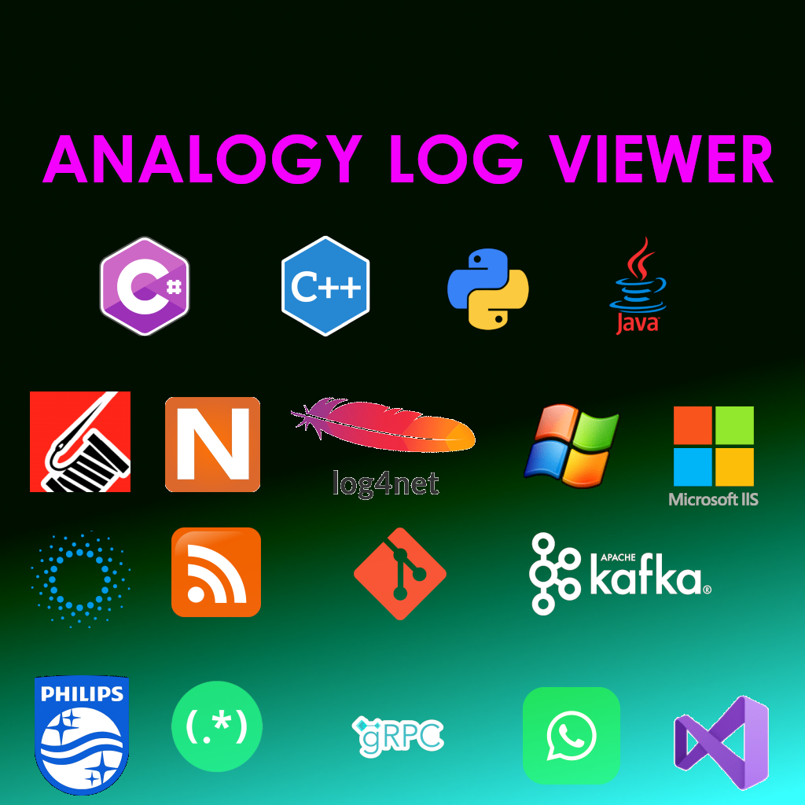
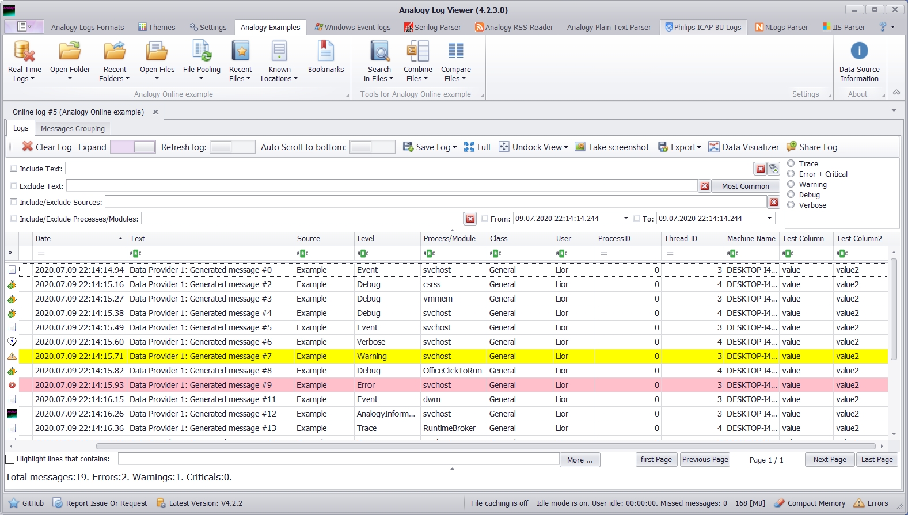
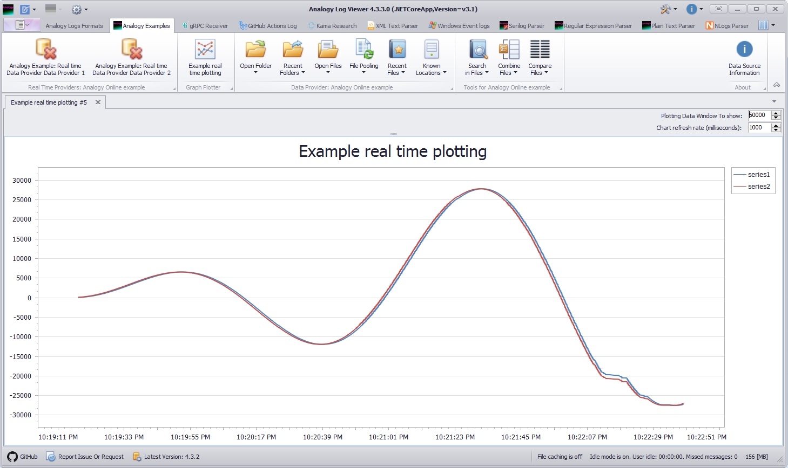
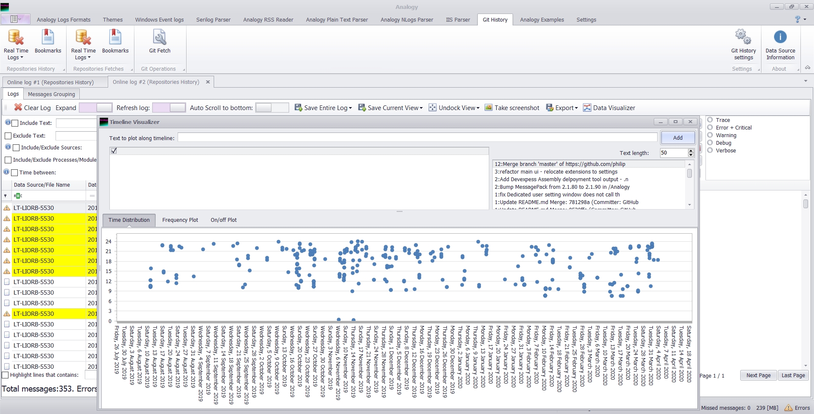
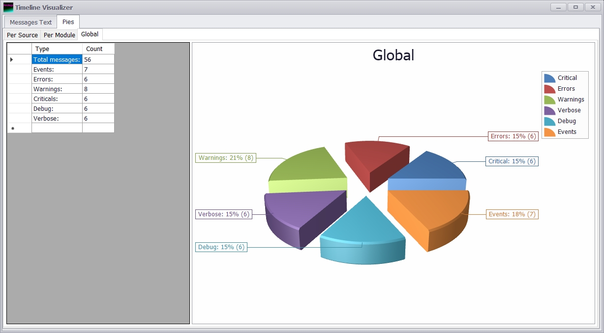
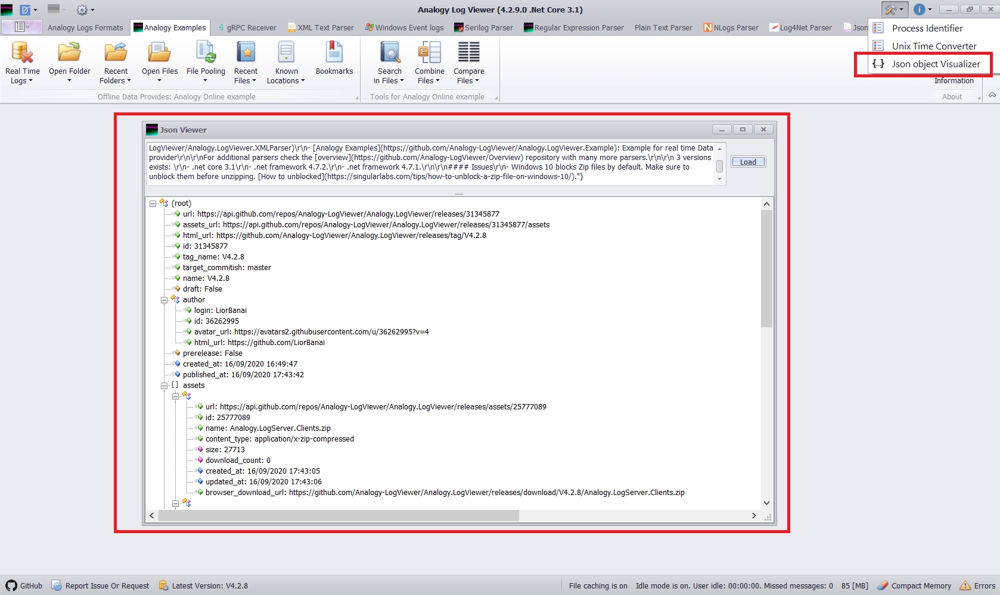

# Analogy Log Viewer    

<p align="center">
    
[](https://app.codacy.com/gh/Analogy-LogViewer/Analogy.LogViewer?utm_source=github.com&utm_medium=referral&utm_content=Analogy-LogViewer/Analogy.LogViewer&utm_campaign=Badge_Grade)
[](https://gitter.im/Analogy-LogViewer/community?utm_source=badge&utm_medium=badge&utm_campaign=pr-badge) 
[](https://dev.azure.com/Analogy-LogViewer/Analogy%20Log%20Viewer/_build/latest?definitionId=1&branchName=master)  
[](https://dependabot.com)
<a href="https://github.com/Analogy-LogViewer/Analogy.LogViewer/issues">
    
</a>

<a href="https://github.com/Analogy-LogViewer/Analogy.LogViewer/blob/master/LICENSE.md">
    
</a>
<a href="https://github.com/Analogy-LogViewer/Analogy.LogViewer/releases">
    
</a>
<a href="https://github.com/Analogy-LogViewer/Analogy.LogViewer/compare/V4.2.11...master">
    
</a>
</p>

A log viewer that can parse log files and stream logs from C#, Python, Java and others.

## Content
[General](https://github.com/Analogy-LogViewer/Analogy.LogViewer#general)

[Usage and how to create custom data providers](https://github.com/Analogy-LogViewer/Analogy.LogViewer#usage)

[Extensions](https://github.com/Analogy-LogViewer/Analogy.LogViewer#Extensions)

[Plotting](https://github.com/Analogy-LogViewer/Analogy.LogViewer#Plotting)

[Logs Analysis and Visualizers](https://github.com/Analogy-LogViewer/Analogy.LogViewer#logs-analysis-and-visualizers)

[brief list of data providers](https://github.com/Analogy-LogViewer/Analogy.LogViewer#brief-list-of-data-providers)

[Issues](https://github.com/Analogy-LogViewer/Analogy.LogViewer#issues)

[Contact](https://github.com/Analogy-LogViewer/Analogy.LogViewer#contact)

## General
Analogy Log Viewer is multi purpose Log Viewer for Windows Operating systems.

Some features of this tool are:
1.	Windows event log support (evtx files)
2.	Aggregation into single view.
3.	Search in multiple files
4.	Combine multiple files
5.	Compare logs 
6.	Themes support
7.	64 bit support (allow loading more files)
8.	Personalization (users settings per user) 
9.	Columns Extendable: Ability to add more columns specific to the data source implementation
10.	Exporting to Excel/CSV files
11. Collaboration-like feature: ability to send log messages to gRPC/WCF service and/or between data providers

Main interaction UI:
- Ribbon area: Log files operations (open) and tools (search/combine/Compare)
- Messages area: File system UI and Main Log viewer area


The application supports the followings data providers:

1. Common logs frameworks like: [Serilog](https://github.com/Analogy-LogViewer/Analogy.LogViewer.Serilog), [NLog](https://github.com/Analogy-LogViewer/Analogy.LogViewer.NLog), [Log4Net](https://github.com/Analogy-LogViewer/Analogy.LogViewer.Log4Net), [Microsoft Logging](https://github.com/Analogy-LogViewer/Analogy.AspNetCore.LogProvider). 

2. Generic file types: [Json Parser](https://github.com/Analogy-LogViewer/Analogy.LogViewer.JsonParser) and [XML parser](https://github.com/Analogy-LogViewer/Analogy.LogViewer.XMLParser).

3. Real time streaming from the following languages: [C#](https://github.com/Analogy-LogViewer/Analogy.AspNetCore.LogProvider), [C++](https://github.com/Analogy-LogViewer/Analogy-cpp-Logging), [Python](https://github.com/Analogy-LogViewer/Analogy-Python-Logging) and [JAVA](https://github.com/Analogy-LogViewer/Analogy-Java-Logging) using [gRPC log Server](https://github.com/Analogy-LogViewer/Real-Time-Log-Server) and client.

4. Custom providers. Create specific parsers for specific applications.

## Usage

Thre are 3 modes of operations:
- real time log server: a gRPC Windows service that can receive messages from any gRPC client and the Log viewer app can connect to it to show real time logs.
- real time logs: different implementation that can receive logs in real time (e.g: Windows event log data provider that show event logs as they are created)
- Offline mode: Parse log files. There are many different implemetations.
For a full list: [see implementations](https://github.com/Analogy-LogViewer/Analogy#log-viewer-application) for common logs files/frameworks.


If you need you can create your own providers:
to implement a new data provider do the following:

0. Create new  cs project and make sure your assembly is named Analogy.LogViewer.*.dll.
1. reference nugets package [Analogy.LogViewer.Interfaces](https://www.nuget.org/packages/Analogy.LogViewer.Interfaces/) and [Analogy.LogViewer.Template](https://www.nuget.org/packages/Analogy.LogViewer.Template/)

2. inherite  ```Analogy.LogViewer.Template.PrimaryFactory``` class  from the template and override some properties:
```csharp
    public class PrimaryFactory : Analogy.LogViewer.Template.PrimaryFactory
    {
        internal static Guid Id { get; }= new Guid("XXXXXXXX");
        public override Guid FactoryId { get; set; } = Id;
        public override string Title { get; set; } = "Name of your provider (like Serilog, Nlog)";
        public override IEnumerable<IAnalogyChangeLog> ChangeLog { get; set; } = ChangeLogList.GetChangeLog();
        public override IEnumerable<string> Contributors { get; set; } = new List<string> { "Lior Banai" };
        public override string About { get; set; } = "Analogy Log Parser";
        public override Image? SmallImage { get; set; } = Resources.Image16x16;
        public override Image? LargeImage { get; set; } = Resources.Image32x32;


    }
```

The FactoryId is the identifier of your provider.
all other providers (real time, offline) refer to this identifier to group them under the tab in the U.

3. create DataProvidersFactory class that contains all your providers (real time or offline):
```csharp
    public class DataProvidersFactory : LogViewer.Template.DataProvidersFactory
    {
        public override Guid FactoryId { get; set; } = PrimaryFactory.Id;
        public override string Title { get; set; } = "Log Parsers";
        public override IEnumerable<IAnalogyDataProvider> DataProviders { get; set; } = new List<IAnalogyDataProvider> 
        {new SomeOfflineDataProvider(), new OnlinelineDataProvider() };
    }
 ```
 
4. To implement offline (log file) Parser inherite ```Analogy.LogViewer.Template.OfflineDataProvider``` and at minimum override the Parse methods and some properties like Id:

```csharp
  public class OfflineDataProvider : Analogy.LogViewer.Template.OfflineDataProvider
  {
      public override Image? SmallImage { get; set; } = null;
      public override Image? LargeImage { get; set; } = null;
      public override string? OptionalTitle { get; set; } = "Some Parser";
      public override string FileOpenDialogFilters { get; set; } = "txt files (*.txt)|*.txt|All files (*.*)|*.*";
      public override IEnumerable<string> SupportFormats { get; set; } = new List<string> { "*.txt" };
      public override string? InitialFolderFullPath { get; set; } = Environment.CurrentDirectory;
      public override Guid Id { get; set; } = new Guid("XXXX");
     
     private PlainTextLogFileParser parser=new PlainTextLogFileParser();
      
      public override Task<IEnumerable<AnalogyLogMessage>> Process(string fileName, CancellationToken token,ILogMessageCreatedHandler messagesHandler)
            => parser.Process(fileName, token, messagesHandler);
```

4. To implement real time streaming Parser inherite ```Analogy.LogViewer.Template.OnlineDataProvider``` and again override needed members.

you can use exisitng projects (like [PowerToys Parser](https://github.com/Analogy-LogViewer/Analogy.LogViewer.PowerToys) for offline and [Windows Event logs](https://github.com/Analogy-LogViewer/Analogy.LogViewer.WindowsEventLogs) for real time)
another option is to check the [Analogy.LogViewer.Example](https://github.com/Analogy-LogViewer/Analogy.LogViewer.Example) example.

5. Put your dll at the same folder as the application. You can download [latest version](https://github.com/Analogy-LogViewer/Analogy.LogViewer/releases)

## Extensions

Along with custom Data Providers you can create extensions for existing providers:
1. In Place extension: Add columns to the log messages data grid to add more information to the data grid,
2. User Control extension: Add new tab in the UI with a custom user control that receive the incoming messages and can create custom logic to handles those.

The example data provider has example for this (you need to enable the extension in the extensions tab in the user settings). 

## Plotting

Along with custom Data Providers you can create Plots of arbitrary data by implementing the ```IAnalogyPlotting ``` Interface:
```csharp
 public interface IAnalogyPlotting
    {
        event EventHandler<AnalogyPlottingPointData> OnNewPointData;
        IEnumerable<(string SeriesName, AnalogyPlottingSeriesType SeriesViewType)> GetChartSeries();
        Guid Id { get; set; }
        /// <summary>
        /// the factory id which this Data providers factory belongs to
        /// </summary>
        Guid FactoryId { get; set; }
        string Title { get; set; }
        Task InitializePlottingAsync(IAnalogyLogger logger);
        Task StartPlotting();
        Task StopPlotting();
    }
}
```
The example data provider has example for this:

## Logs Analysis and Visualizers

The application has some analyzers and visualization.
- Time Distribution: shows at what time of day the message was logged.
- Frequency: shows count of how many repeated messages were logged (you can define the text to filter).
- On/Off Distribution: Show existance of message along the time.



- Pie Charts: shows pie charts per source/module/log level.



- Json Visualizer:


## brief list of data providers

- For a complete list visit [Analogy Overview repository](https://github.com/Analogy-LogViewer/Overview).

#### Real Time Data providers:
| Data Provider   |      Description      |
|----------|:---------------|
| [gRPC Real Time Data Provider](https://github.com/Analogy-LogViewer/Analogy.LogViewer.gRPC) | A gRPC Data provider that connect to Analogy Log Server and read message back to Analogy Log Viewer
| [Analogy.AspNetCore.LogProvider](https://github.com/Analogy-LogViewer/Analogy.AspNetCore.LogProvider/) | A AspNetCore provider that streams logs to Analogy Log Server
| [Analogy.LogViewer.NLog.Targets](https://github.com/Analogy-LogViewer/Analogy.LogViewer.NLog.Targets/) | NLog Target that streams logs to Analogy Log Server
| [Serilog Sink](https://github.com/Analogy-LogViewer/Analogy.LogViewer.Serilog) | Serilog Sink  that streams logs to Analogy Log Server
|[Windows event logs](https://github.com/Analogy-LogViewer/Analogy.LogViewer.WindowsEventLogs) | Real time Component of Windows Event logs Parser

#### Offline Data providers:
| Data Provider   |      Description      |
|----------|:---------------|
|[Serilog Parser](https://github.com/Analogy-LogViewer/Analogy.LogViewer.Serilog) | Parser for Serilog log files
|[NLog Parser](https://github.com/Analogy-LogViewer/Analogy.LogViewer.NLogProvider) | Parser for NLog log files
|[Log4Net Parser](https://github.com/Analogy-LogViewer/Analogy.LogViewer.Log4Net) | Parser for Log4Net log files
|[Regular Expression Parser](https://github.com/Analogy-LogViewer/Analogy.LogViewer.RegexParser) | Regular Expression Parser
|[IIS log Parser](https://github.com/Analogy-LogViewer/Analogy.LogViewer.IISLogParser) | Parser for IIS log files
|[RSS Reader](https://github.com/Analogy-LogViewer/Analogy.LogViewer.RSSReader) | RSS Feeds inside Analogy Log Viewer
|[Generic Json Log Parser](https://github.com/Analogy-LogViewer/Analogy.LogViewer.JsonParser) | Generic Json Parser
|[XML Parser](https://github.com/Analogy-LogViewer/Analogy.LogViewer.XMLFileProvider) |  Generic XML Parser
|[Windows event logs](https://github.com/Analogy-LogViewer/Analogy.LogViewer.WindowsEventLogs) | Windows Event logs Parser
|[Plain Text Parser](https://github.com/Analogy-LogViewer/Analogy.LogViewer.PlainTextParser)  | Plain Text Parser
|[Git History](https://github.com/Analogy-LogViewer/Analogy.LogViewer.GitHistory) | Display your Git Repository commit history
|[Kafka Producer/ consumer](https://github.com/Analogy-LogViewer/Analogy.LogViewer.KafkaProvider) | Kafka Producer / Consumer


## Issues
- Windows 10 blocks Zip files by default. Make sure to unblock them before unzipping. [How to unblocked](https://singularlabs.com/tips/how-to-unblock-a-zip-file-on-windows-10/).

<a name="contact"></a>
## Contact

### Owner
- [Lior Banai](mailto:liorbanai@gmail.com)
