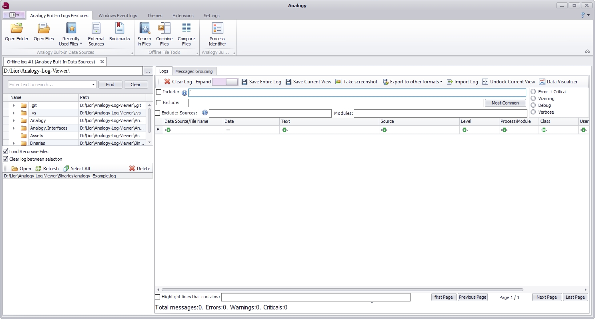
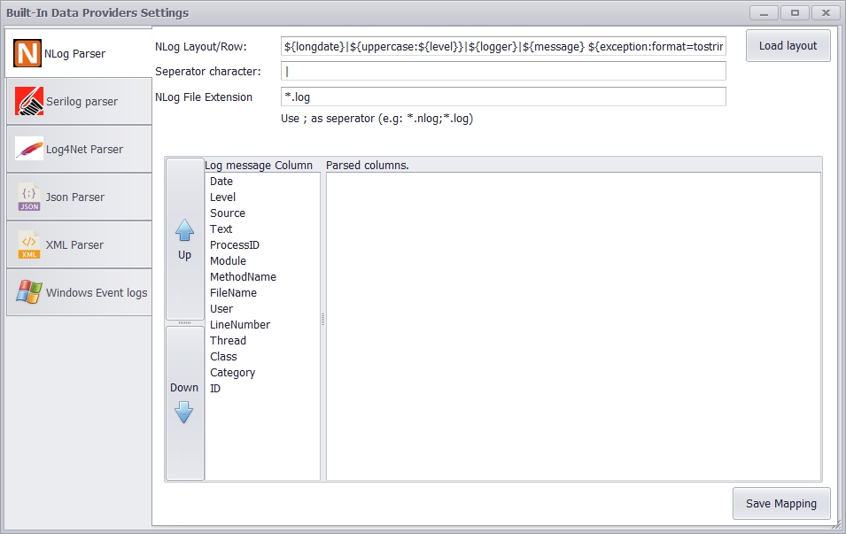

# Analogy Log Viewer    

Analogy Log Viewer is multi purpose Log Viewer for Windows Operating systems (with built-in NLog Parser and others).

The application has many standard operations for analysis logs (like filtering, excluding) but its strength is in the ability to add additional custom data sources by implementing few interfaces.
This allows adding any logs formats and/or custom modification of logs before presenting the data in the UI Layer.
Some features of this tool are:
1.	Windows event log support (evtx files)
2.	Logs aggregation into single view.
3.	Search in multiple files
4.	Combine multiple files
5.	Compare logs 
6.	Themes support
7.	64 bit support (allow loading more files)
8.	Personalization (users settings per user) 
9.	Columns extension to add more columns specific to the data source implementation
10.	Exporting to Excel/CSV files

Main interaction UI:
- Ribbon area: Log files operations (open) and tools (search/combine/Compare)
- Messages area: File system UI and Main Log viewer area

# Dependencies & Build
- Main Application UI is complied to .Net Framework 4.7.2 and to .Net Core 3.0.
The projects targets .Net Framework 4.7.2/Core 3.0 . The supported version of Visual studio for this framework is Visual studio 2017 (or above).
After successfull build any custom data source assemblies should be placed at the same folder as the executable (Analogy.exe) with the folowing pattern Analogy.Implementation.*.dll
- Analogy Interfaces assembly is complied to .Net Standard 2.0.

Detailed Documentation will be added to the Wiki page.

- DevExpress User Controls:
in order to compile this code [DevExpress](https://www.devexpress.com/) assemblies are required (winforms package only).

# Data Providers
The following  custom data providers exists:
- [Confluent's Apache Kafka .NET client Producer and consumer to Analogy](https://github.com/LiorBanai/Analogy.LogViewer.KafkaProvider)
- [NLog Parser with layout customization](https://github.com/Analogy-LogViewer/Analogy.LogViewer.NLog)
- Windows event logs
- [Catel log Parser](https://github.com/Analogy-LogViewer/Analogy.LogViewer.CatelProject)
- [IIS log Parser](https://github.com/Analogy-LogViewer/Analogy.LogViewer.IISLogParser)
- [RSS Reader](https://github.com/Analogy-LogViewer/Analogy.LogViewer.RSSReader)

Data providers settings are managed in their own user setting windows

# Usage

The primary usage of this application is to implement your own data source of logs of your own business domain by implementing small Interface but there are built in data providers (like NLog parser) that can be used without and additional coding.

## Contact

### Owner
- [Lior Banai](mailto:liorbanai@gmail.com)

