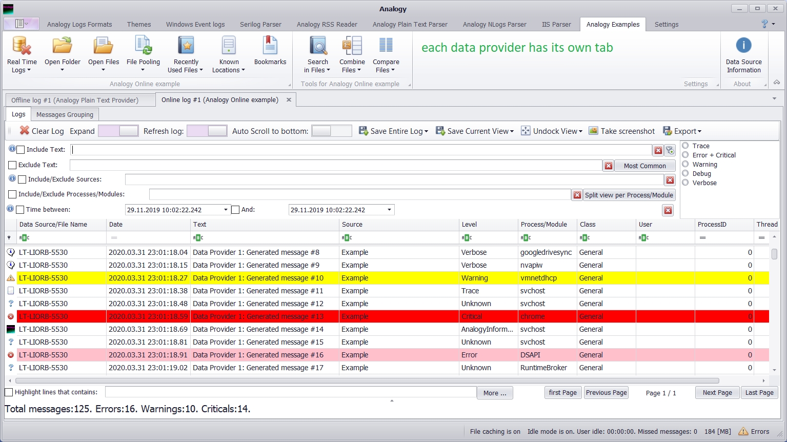

# Analogy Log Viewer

Analogy Log Viewer is multi purpose Log Viewer for Windows Operating systems.

The application has many standard operations for analysis logs (like filtering, excluding) but its strength is in the ability to add additional custom data sources by implementing few interfaces.
This allows adding any logs formats and/or custom modification of logs before presenting the data in the UI Layer.
Some features of this tool are:
1.	Windows event log support (evtx files)
2.	Logs aggregation into single view.
3.	Search in multiple files
4.	Combine multiple files
5.	Compare logs 
6.	Themes support
7.	64 bit support (allow loading more files compare to old tool)
8.	Personalization (users settings per user) 
9.	Columns extension to add more columns specific to the data source implementation
10.	Exporting to Excel/CSV files

# Dependencies & Build

The projects targets .Net Framework 4.7.1. The supported version of Visual studio for this framework is Visual studio 2017 (or above).

## Contact

### Owner
- [Lior Banai](mailto:liorbanai@gmail.com)

## Example Screenshots
Main interaction UI:
- Ribbon area: Log files operations (open) and tools (search/combine/Compare)
- Messages area: File system UI and Main Log viewer area
